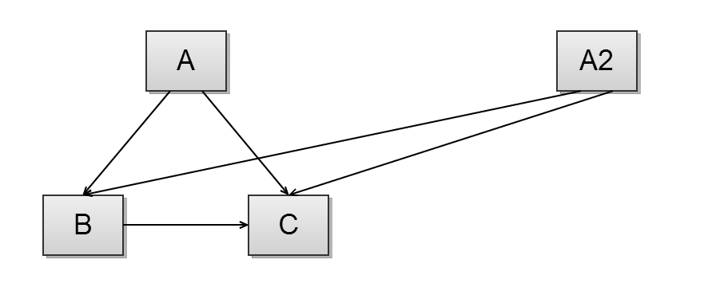
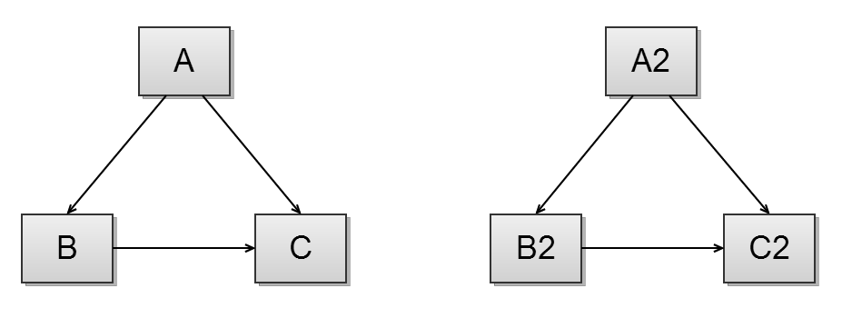

# DeepCopy

DeepCopy helps you create deep copies (clones) of your objects. It is designed to handle cycles in the association graph.

[](https://travis-ci.org/myclabs/DeepCopy) [](https://coveralls.io/r/myclabs/DeepCopy?branch=master) [](https://scrutinizer-ci.com/g/myclabs/DeepCopy/)


## How?

Install with Composer:

```json
{
    "require": {
        "myclabs/deep-copy": "*"
    }
}
```

Use simply:

```php
$deepCopy = new DeepCopy();
$myCopy = $deepCopy->copy($myObject);
```


## Why?

- How do you create copies of your objects?

```php
$myCopy = clone $myObject;
```

- How do you create **deep** copies of your objects (i.e. copying also all the objects referenced in the properties)?

You use [`__clone()`](http://www.php.net/manual/en/language.oop5.cloning.php#object.clone) and implement the behavior yourself.

- But how do you handle **cycles** in the association graph?

Now you're in for a big mess :(


### Using simply `clone`



### Overridding `__clone()`


### With DeepCopy




## How it works

DeepCopy traverses recursively all your object's properties and clones them.

To avoid cloning the same object twice (and thus, keep you object graph), it keeps a hash-map of all instances.


## Going further

You can add filters to customize the copy process.

The method to add a filter is `$deepCopy->addFilter($filter, $matcher)`,
with `$filter` implementing `DeepCopy\Filter\Filter`
and `$matcher` implementing `DeepCopy\Matcher\Matcher`.

We provide some generic filters and matchers.

### Matchers

#### Property name

The `PropertyNameMatcher` will match a property by its name:

```php
$matcher = new PropertyNameMatcher('id');
// will apply a filter to any property of any objects named "id"
```

#### Specific property

The `PropertyMatcher` will match a specific property of a specific class:

```php
$matcher = new PropertyMatcher('MyClass', 'id');
// will apply a filter to the property "id" of any objects of the class "MyClass"
```

#### Property type

The `PropertyTypeMatcher` will match a property by its type (instance of a class):

```php
$matcher = new PropertyTypeMatcher('Doctrine\Common\Collections\Collection');
// will apply a filter to any property that is an instance of Doctrine\Common\Collections\Collection
```

### Filters

#### `SetNullFilter`

Let's say for example that you are copying a database record (or a Doctrine entity), so you want the copy not to have any ID:

```php
$myObject = MyClass::load(123);
echo $myObject->id; // 123

$deepCopy = new DeepCopy();
$deepCopy->addFilter(new SetNullFilter(), new PropertyNameMatcher('id'));
$myCopy = $deepCopy->copy($myObject);

echo $myCopy->id; // null
```

#### `KeepFilter`

If you want a property to remain untouched (for example, an association to an object):

```php
$deepCopy = new DeepCopy();
$deepCopy->addFilter(new KeepFilter(), new PropertyMatcher('MyClass', 'category'));
$myCopy = $deepCopy->copy($myObject);

// $myCopy->category has not been touched
```

#### `DoctrineCollectionFilter`

If you use Doctrine and want to copy an entity, you will need to use the `DoctrineCollectionFilter`:

```php
$deepCopy = new DeepCopy();
$deepCopy->addFilter(new DoctrineCollectionFilter(), new PropertyTypeMatcher('Doctrine\Common\Collections\Collection'));
$myCopy = $deepCopy->copy($myObject);
```

#### `DoctrineEmptyCollection`

If you use Doctrine and want to copy an entity who contains `Collection` and you want reset her, you will need to use `DoctrineEmptyCollectionFilter`

```php
// Assuming property children is a collection who contains many elements
$deepCopy = new DeepCopy();
$deepCopy->addFilter(new DoctrineEmptyCollectionFilter(), new PropertyMatcher('MyClass', 'children'));
$myCopy = $deepCopy->copy($myObject);

// $myCopy->children will return an empty collection
```


## Contributing

DeepCopy is distributed under the MIT license.

### Tests

Running the tests is simple:

```php
phpunit
```
